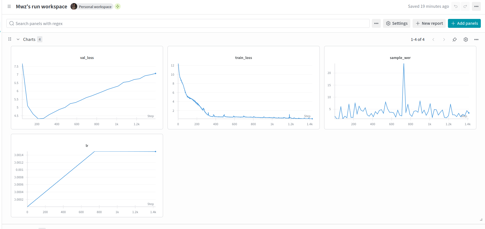

# Urdu Whisper model in Pytorch from scratch implementation

Trained a small Urdu whisper model

[Robust Speech Recognition via Large-Scale Weak Supervision](https://cdn.openai.com/papers/whisper.pdf)

## ModelArgs Hyperparameters

| Parameter               | Value                  | Description                                                                 |
|-------------------------|------------------------|-----------------------------------------------------------------------------|
| `batch_size`            |128                     | The number of samples processed before the model is updated.                |
| `max_lr`                |1.5e-3                  | Maximum learning rate.                                                      |
| `dropout`               | 0.1                    | Dropout rate for regularization.                                            |
| `epochs`                |2                       | Number of training epochs.                                                  |
| `block_size`            | 64                     | Sequence length (number of tokens or time steps).                           |
| `tgt_vocab_size`        | 200024                 | Size of the target vocabulary.                                              |
| `embeddings_dims`       | 512                    | Dimensionality of token embeddings.                                         |
| `attn_dropout`          | 0.1                    | Dropout rate for attention layers.                                          |
| `no_of_heads`           | 4                      | Number of attention heads in multi-head attention.                          |
| `no_of_decoder_layers`  | 6                      | Number of decoder layers in the model.                                      |
| `weight_decay_optim`    | 0.1                    | Weight decay for the optimizer.                                             |
| `log_mel_features`      | 80                     | Number of Mel spectrogram features.                                         |
| `kernel_size`           | 3                      | Kernel size for convolutional layers.                                       |
| `stride`                | 2             | Stride for convolutional layers.                                            |
| `sr`                    | 16000                  | Sampling rate of the audio.                                                 |
| `device`                | `'cuda:0'`             | Device to run the model on (e.g., GPU).                                     |
| `SAMPLING_RATE`         | 16000                  | Sampling rate of the audio.                                                 |
| `N_MELS`                | 80                     | Number of Mel bins in the spectrogram.                                      |
| `WINDOW_DURATION`       | 0.025                  | Duration of the analysis window in seconds (25 ms).                         |
| `STRIDE_DURATION`       | 0.010                  | Stride between consecutive windows in seconds (10 ms).                      |
| `max_t`                 | 500                    | Maximum time steps in the spectrogram.                                      |
| `n_channels`            | 80                     | Number of channels in the input spectrogram.                                |

###  Weights on Hugging Face

[Whisper Urdu](https://huggingface.co/mahwizzzz/whisper-urdu-pytorch)

### Dataset

[Common Voice Corpus 11.0 ](https://huggingface.co/datasets/mozilla-foundation/common_voice_11_0)

Used the 'xs' snapshot.

### Frameworks:
**Pytorch**

### Epochs/Steps
Epochs (train) = 2

Val iterations = every epoch

### Loss Curves

